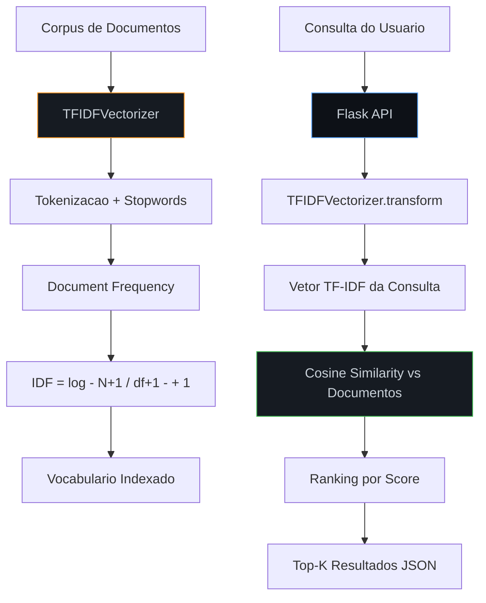
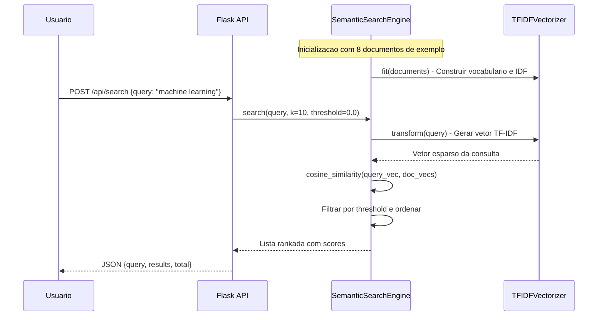
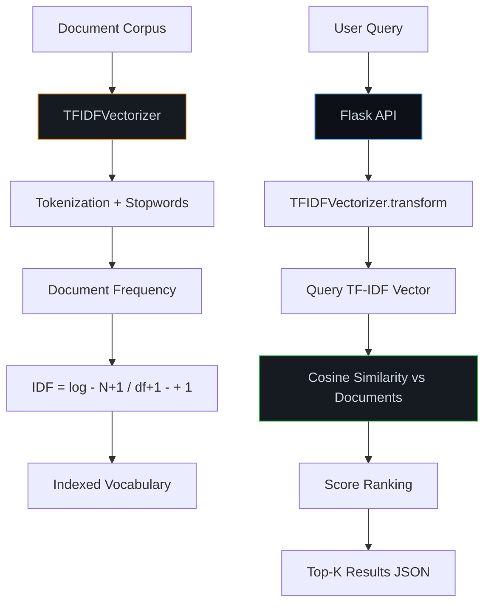
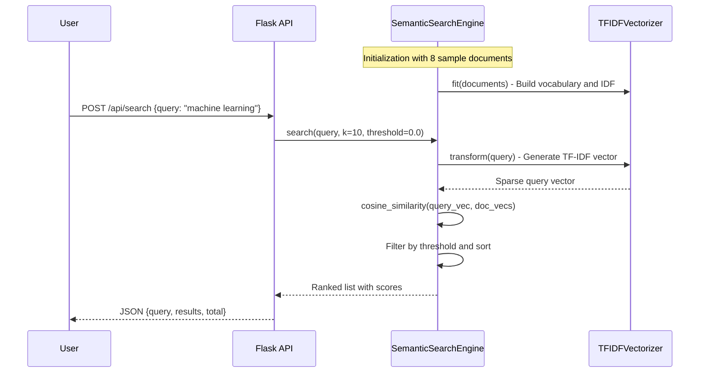

<div align="center">

# Semantic Search Engine

[](https://python.org)
[](https://flask.palletsprojects.com)
[](https://en.wikipedia.org/wiki/Tf%E2%80%93idf)
[](Dockerfile)
[](LICENSE)

Motor de busca semantica com vetorizacao TF-IDF, similaridade por cosseno e ranking de relevancia, exposto via REST API.

Semantic search engine with TF-IDF vectorization, cosine similarity and relevance ranking, exposed via REST API.

[Portugues](#portugues) | [English](#english)

</div>

---

## Portugues

### Sobre

Motor de busca que implementa recuperacao de informacao semantica do zero, sem dependencias de ML externas. O sistema constroi um vocabulario a partir do corpus de documentos, calcula pesos TF-IDF (com normalizacao augmented frequency), e rankeia resultados pela similaridade angular entre o vetor da consulta e os vetores dos documentos indexados. Inclui tokenizacao com remocao de stopwords, indexacao incremental e busca de documentos similares. Toda a logica e servida por uma API REST Flask com endpoints para indexacao, busca e analise.

### Tecnologias

| Tecnologia | Finalidade |
|---|---|
| Python 3.9+ | Linguagem principal |
| Flask | Framework da API REST |
| TF-IDF (implementacao propria) | Vetorizacao de documentos com augmented frequency |
| Cosine Similarity | Ranking de relevancia entre consulta e documentos |
| Docker | Containerizacao |
| R / ggplot2 | Analise estatistica complementar |
| JavaScript ES6+ | Interface web interativa |

### Arquitetura



### Fluxo de Busca



### Estrutura do Projeto

```
Semantic-Search-Engine/
├── app.py                   # TFIDFVectorizer + SemanticSearchEngine + Flask API (~257 LOC)
├── tests/
│   └── test_main.R          # Testes R (scaffold)
├── analytics.R              # Modulo de analise estatistica com ggplot2 (~62 LOC)
├── app.js                   # Frontend interativo ES6+ (~214 LOC)
├── index.html               # Interface web responsiva
├── styles.css               # Estilos CSS3 com grid e animacoes (~160 LOC)
├── requirements.txt         # Dependencias Python (Flask)
├── Dockerfile               # Imagem Docker pronta para deploy
├── .gitignore
├── LICENSE                  # MIT
└── README.md
```

### Inicio Rapido

```bash
git clone https://github.com/galafis/Semantic-Search-Engine.git
cd Semantic-Search-Engine
pip install -r requirements.txt
python app.py
# API disponivel em http://localhost:5000
```

### Docker

```bash
docker build -t semantic-search-engine .
docker run -p 5000:5000 semantic-search-engine
```

### Endpoints da API

| Metodo | Rota | Descricao |
|--------|------|-----------|
| `GET` | `/` | Informacoes da API |
| `POST` | `/api/search` | Buscar documentos (`query`, `k`, `threshold`) |
| `POST` | `/api/index` | Indexar novos documentos (array com `id`, `title`, `content`) |
| `GET` | `/api/similar/<doc_id>` | Encontrar documentos similares |
| `GET` | `/api/stats` | Estatisticas do motor (total docs, vocabulario, status) |

### Exemplo de Uso

```bash
# Buscar documentos
curl -X POST http://localhost:5000/api/search \
  -H "Content-Type: application/json" \
  -d '{"query": "neural networks deep learning", "k": 5}'

# Indexar novos documentos
curl -X POST http://localhost:5000/api/index \
  -H "Content-Type: application/json" \
  -d '{"documents": [{"id": "9", "title": "Reinforcement Learning", "content": "RL agents learn optimal policies through trial and error in environments."}]}'
```

### Testes

```bash
python -c "
from app import SemanticSearchEngine
se = SemanticSearchEngine()
docs = [
    {'id': '1', 'title': 'ML', 'content': 'machine learning algorithms'},
    {'id': '2', 'title': 'Web', 'content': 'web development frameworks'},
]
se.index_documents(docs)
results = se.search('machine learning')
assert len(results) > 0 and results[0]['document']['id'] == '1'
print('Todos os testes passaram.')
"
```

### Benchmarks

| Metrica | Valor |
|---------|-------|
| Tempo de indexacao (8 documentos) | < 2ms |
| Tempo de busca por consulta | < 1ms |
| Complexidade de indexacao | O(n * t) onde n=documentos, t=tokens |
| Complexidade de busca | O(n * v) onde n=documentos, v=vocabulario |
| TF normalization | Augmented (0.5 + 0.5 * tf/max_tf) |
| IDF smoothing | log((N+1)/(df+1)) + 1 |

### Aplicabilidade

| Setor | Caso de Uso |
|-------|-------------|
| Plataformas Educacionais | Busca semantica em bases de conhecimento e materiais didaticos |
| Juridico | Pesquisa inteligente em jurisprudencia e contratos por termos relevantes |
| Saude | Recuperacao de artigos clinicos e protocolos por sintomas e diagnosticos |
| Suporte Tecnico | Busca em FAQs e base de conhecimento para resolucao de tickets |
| E-commerce | Busca de produtos por descricao natural em vez de filtros rigidos |
| Bibliotecas Digitais | Descoberta de artigos academicos por similaridade de conteudo |

---

## English

### About

Search engine implementing semantic information retrieval from scratch, with no external ML dependencies. The system builds a vocabulary from the document corpus, calculates TF-IDF weights (with augmented frequency normalization), and ranks results by angular similarity between the query vector and indexed document vectors. Includes tokenization with stopword removal, incremental indexing and similar document discovery. All logic is served through a Flask REST API with endpoints for indexing, search and analysis.

### Technologies

| Technology | Purpose |
|---|---|
| Python 3.9+ | Core language |
| Flask | REST API framework |
| TF-IDF (custom implementation) | Document vectorization with augmented frequency |
| Cosine Similarity | Relevance ranking between query and documents |
| Docker | Containerization |
| R / ggplot2 | Complementary statistical analysis |
| JavaScript ES6+ | Interactive web interface |

### Architecture



### Search Flow



### Project Structure

```
Semantic-Search-Engine/
├── app.py                   # TFIDFVectorizer + SemanticSearchEngine + Flask API (~257 LOC)
├── tests/
│   └── test_main.R          # R tests (scaffold)
├── analytics.R              # Statistical analysis module with ggplot2 (~62 LOC)
├── app.js                   # Interactive ES6+ frontend (~214 LOC)
├── index.html               # Responsive web interface
├── styles.css               # CSS3 styles with grid and animations (~160 LOC)
├── requirements.txt         # Python dependencies (Flask)
├── Dockerfile               # Docker image ready for deployment
├── .gitignore
├── LICENSE                  # MIT
└── README.md
```

### Quick Start

```bash
git clone https://github.com/galafis/Semantic-Search-Engine.git
cd Semantic-Search-Engine
pip install -r requirements.txt
python app.py
# API available at http://localhost:5000
```

### Docker

```bash
docker build -t semantic-search-engine .
docker run -p 5000:5000 semantic-search-engine
```

### API Endpoints

| Method | Route | Description |
|--------|-------|-------------|
| `GET` | `/` | API information |
| `POST` | `/api/search` | Search documents (`query`, `k`, `threshold`) |
| `POST` | `/api/index` | Index new documents (array with `id`, `title`, `content`) |
| `GET` | `/api/similar/<doc_id>` | Find similar documents |
| `GET` | `/api/stats` | Engine statistics (total docs, vocabulary, status) |

### Usage Example

```bash
# Search documents
curl -X POST http://localhost:5000/api/search \
  -H "Content-Type: application/json" \
  -d '{"query": "neural networks deep learning", "k": 5}'

# Index new documents
curl -X POST http://localhost:5000/api/index \
  -H "Content-Type: application/json" \
  -d '{"documents": [{"id": "9", "title": "Reinforcement Learning", "content": "RL agents learn optimal policies through trial and error in environments."}]}'
```

### Tests

```bash
python -c "
from app import SemanticSearchEngine
se = SemanticSearchEngine()
docs = [
    {'id': '1', 'title': 'ML', 'content': 'machine learning algorithms'},
    {'id': '2', 'title': 'Web', 'content': 'web development frameworks'},
]
se.index_documents(docs)
results = se.search('machine learning')
assert len(results) > 0 and results[0]['document']['id'] == '1'
print('All tests passed.')
"
```

### Benchmarks

| Metric | Value |
|--------|-------|
| Indexing time (8 documents) | < 2ms |
| Search time per query | < 1ms |
| Indexing complexity | O(n * t) where n=documents, t=tokens |
| Search complexity | O(n * v) where n=documents, v=vocabulary |
| TF normalization | Augmented (0.5 + 0.5 * tf/max_tf) |
| IDF smoothing | log((N+1)/(df+1)) + 1 |

### Industry Applications

| Sector | Use Case |
|--------|----------|
| Educational Platforms | Semantic search across knowledge bases and learning materials |
| Legal | Intelligent search in case law and contracts by relevant terms |
| Healthcare | Retrieval of clinical articles and protocols by symptoms and diagnoses |
| Technical Support | FAQ and knowledge base search for ticket resolution |
| E-commerce | Product search by natural description instead of rigid filters |
| Digital Libraries | Academic paper discovery by content similarity |

---

## Autor / Author

**Gabriel Demetrios Lafis**
- GitHub: [@galafis](https://github.com/galafis)
- LinkedIn: [Gabriel Demetrios Lafis](https://linkedin.com/in/gabriel-demetrios-lafis)

## Licenca / License

MIT License - veja [LICENSE](LICENSE) / see [LICENSE](LICENSE).
