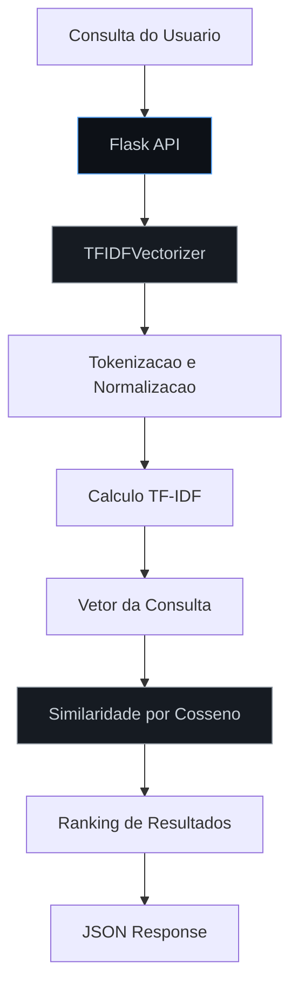
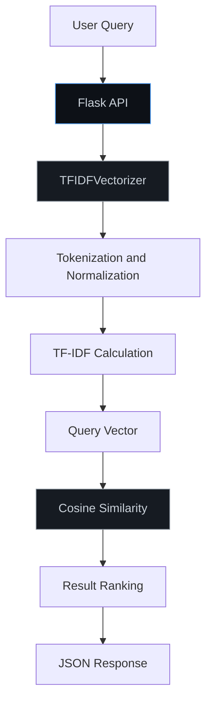

# Semantic Search Engine

Motor de busca semantica utilizando TF-IDF e similaridade por cosseno.

Semantic search engine using TF-IDF vectorization and cosine similarity.

[](https://python.org)
[](https://flask.palletsprojects.com)
[](LICENSE)
[](Dockerfile)

[Portugues](#portugues) | [English](#english)

---

## Portugues

### Visao Geral

Motor de busca que implementa recuperacao de informacao semantica:

- **Vetorizacao TF-IDF**: Transforma documentos em vetores ponderados por frequencia de termo e frequencia inversa de documento.
- **Similaridade por Cosseno**: Rankeia resultados pela similaridade angular entre vetores de consulta e documento.
- **Documentos Similares**: Encontra documentos relacionados dado um documento de referencia.

### Arquitetura



### Inicio Rapido

```bash
git clone https://github.com/galafis/Semantic-Search-Engine.git
cd Semantic-Search-Engine
pip install -r requirements.txt
python app.py
```

### Endpoints

| Metodo | Rota | Descricao |
|--------|------|-----------|
| POST | `/api/search` | Buscar documentos por consulta |
| POST | `/api/index` | Indexar novos documentos |
| GET | `/api/similar/<doc_id>` | Encontrar documentos similares |
| GET | `/api/stats` | Estatisticas do motor |

### Estrutura do Projeto

```
Semantic-Search-Engine/
├── app.py              # API Flask e motor de busca
├── requirements.txt
├── LICENSE
└── README.md
```

---

## English

### Overview

Search engine implementing semantic information retrieval:

- **TF-IDF Vectorization**: Transforms documents into vectors weighted by term frequency and inverse document frequency.
- **Cosine Similarity**: Ranks results by angular similarity between query and document vectors.
- **Similar Documents**: Finds related documents given a reference document.

### Architecture



### Quick Start

```bash
git clone https://github.com/galafis/Semantic-Search-Engine.git
cd Semantic-Search-Engine
pip install -r requirements.txt
python app.py
```

### Tests

```bash
python -m pytest tests/ -v
```

---

## Autor / Author

**Gabriel Demetrios Lafis**
- GitHub: [@galafis](https://github.com/galafis)
- LinkedIn: [Gabriel Demetrios Lafis](https://linkedin.com/in/gabriel-demetrios-lafis)

## Licenca / License

MIT License - veja [LICENSE](LICENSE) / see [LICENSE](LICENSE).
